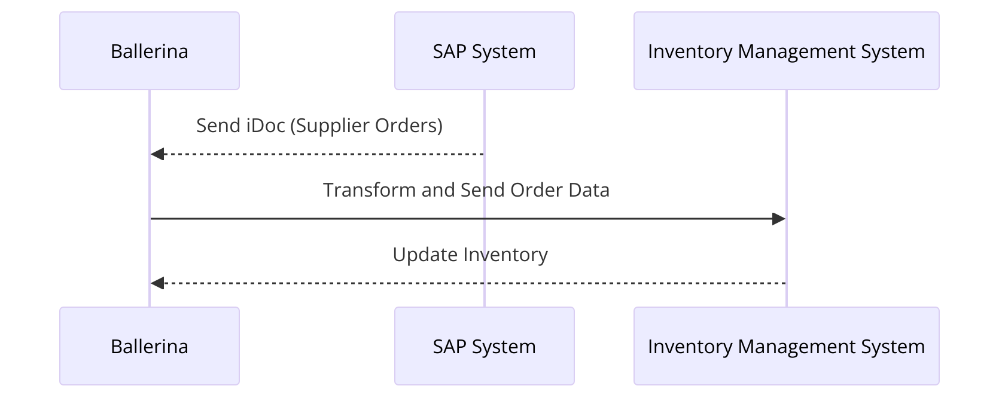

# Example Scenario: Automated Supplier Order Processing via iDoc Listener

In this example, we will demonstrate how to use the Ballerina SAP JCo Connector to automate order processing for a fictional company named "AutoParts Inc." This company specializes in automotive parts and receives orders from various suppliers via SAP iDocs. The scenario involves setting up an iDoc listener that automates the process of receiving and transforming these iDocs into actionable order data within the company's inventory management system.



**Step-by-Step Process:**

1. **Set Up iDoc Listener**: Initialize a listener in Ballerina to continuously monitor for incoming iDocs from SAP pertaining to new supplier orders.
2. **Receive iDoc**: Automatically capture incoming iDocs which contain detailed supplier order data.
3. **Data Transformation**: Convert the iDoc XML data into Ballerina records suitable for processing in the internal systems. This step includes mapping complex supplier information and part details from the iDoc format to the internal order format.
4. **Update Inventory System**: Use the transformed data to update the inventory system, indicating new stock levels or pending orders that need to be fulfilled.

**Tip:** To do the data transformation from ORDERS05 iDoc format to internal record, we first generate the necessary records to represent the iDoc by utilizing the Ballerina [XML to Record](https://ballerina.io/learn/by-example/xml-to-record-conversion/) VS Code function. This function helps create a Ballerina record structure that matches the schema of the iDoc. Next, we use the [Ballerina Data Mapper](https://ballerina.io/learn/vs-code-extension/implement-the-code/data-mapper/) extension to map the order data fields in iDoc to the corresponding fields of internal order record. Once the data mapping is complete, the record can be converted into XML format, which is the iDoc format that can be sent to the SAP system.

## Prerequisites

### 1. Setup SAP JCo Connector

Ensure that the SAP JCo Connector libraries are installed and properly configured on your system. Also, ensure you have valid credentials to access your SAP system.
Refer to the [Setup Guide](../../README.md) for necessary credentials.

### 2. Configuration

Configure the necessary SAP connection parameters in `Config.toml` in the example directory:

```toml
host = "sap.autoparts.com"
systemNumber = "00"
jcoClient = "001"
user = "listener"
password = "password123"
group = "INBOUND"
```

## Run the Example

Execute the following command to run the example:

```bash
bal run
```

Monitor the output for logs indicating the receipt and processing of iDocs, confirming that the system is operational and effectively managing incoming supplier orders. This automation not only saves time but also ensures that the inventory system is consistently updated with the latest order data.

---

This structure provides clear instructions on how to set up and execute the example, emphasizing the integration and automation capabilities of Ballerina in handling iDocs for supplier order management.

